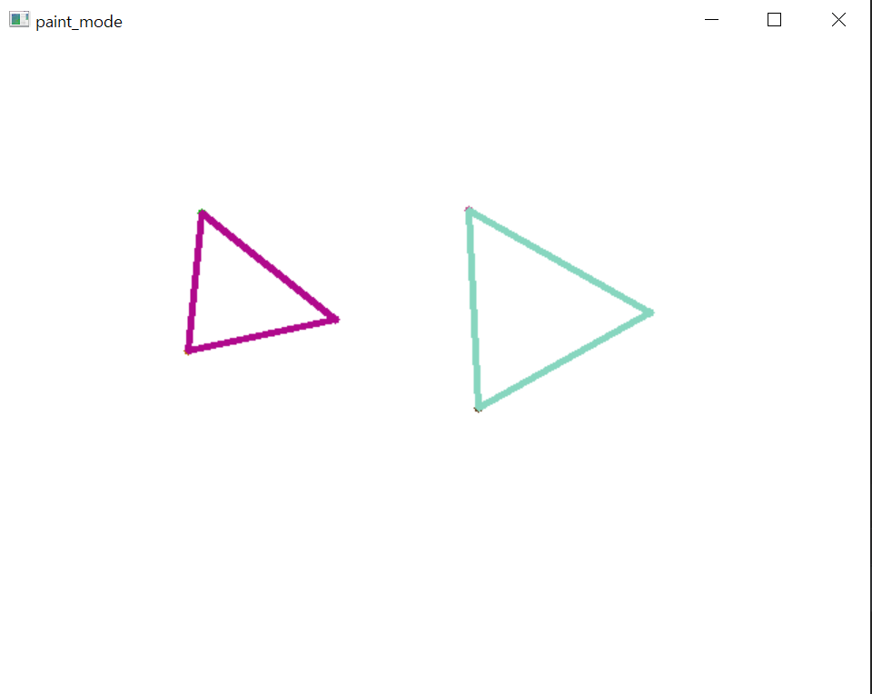
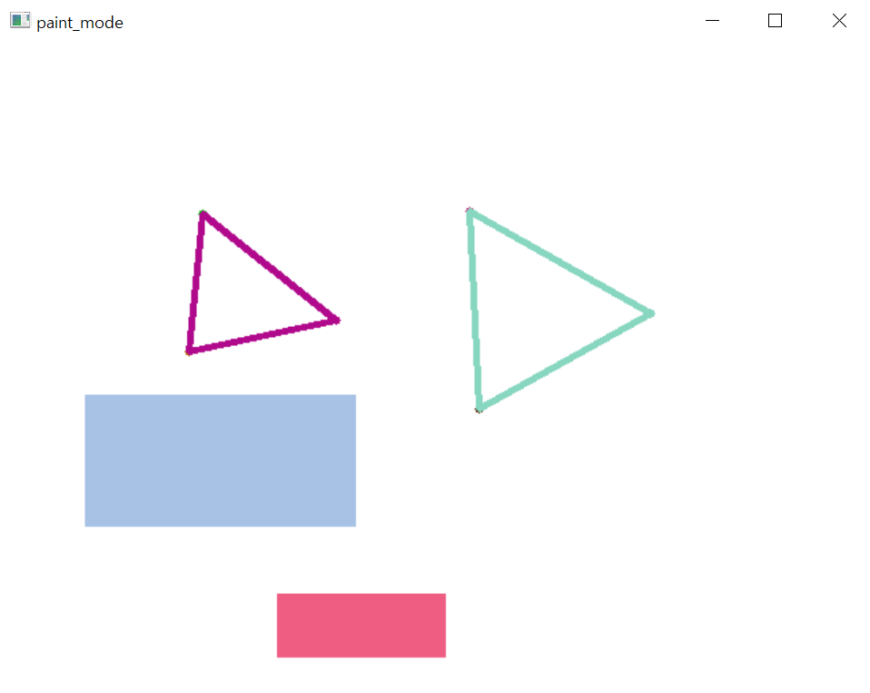
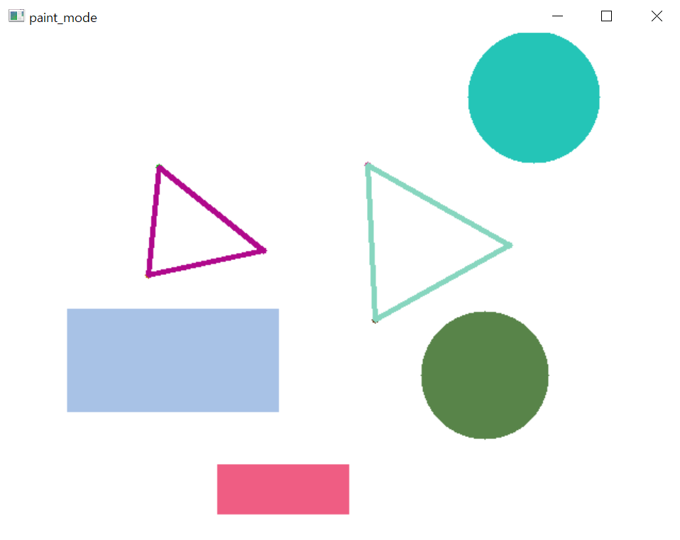

# GeoArt
"Geometry" that are limited to drawing circle, rectangle and triangle and "Art"

## How to use
1. Run ShapePainter.py
2. Click three times at different position -> triangle

3. Press "m" and drag mouse -> Rectangle

4. Press "m" one more time and drage mouse -> Circle

5. Press "m" -> triangle

### **Enjoy Drawing!!!**:smile::smile:
